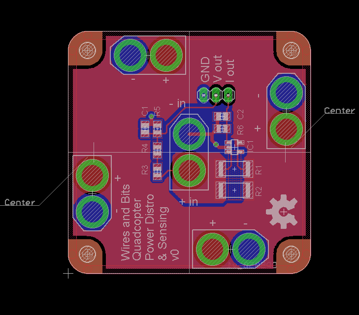

#Quadcopter Power Distribution & Sensor board#

This board will simplify your power distribution on your small to medium sized quadcopter. IT includes a built in current sensor to reduce weight and the hassle of adding an external one.

See the [schematic](QuadPowerDistro v0 Schematic.png) for more information.

##Dimensions##

* The PCB is 50mm by 50mm and 1.6mm thick.
* The corners have a 4mm radius.
* The mounting holes are 3.2mm in diameter and are 4mm from the edges.

##Buying##
This board can be bought, assembled for your quadcopter on Tindie in 3 flavours.

##License##

 QuadcopterPowerDistro by Pinski1 is licensed under a <a rel="license" href="http://creativecommons.org/licenses/by/4.0/">Creative Commons Attribution 4.0 International License</a>.